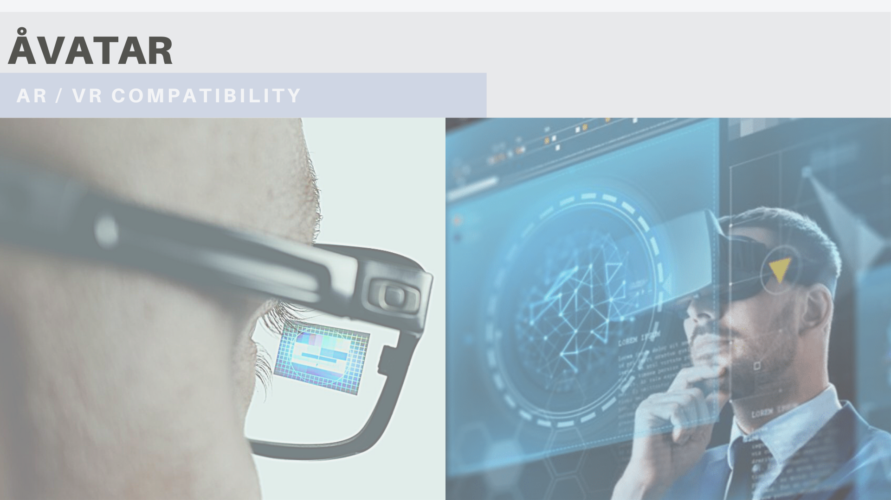

Table of Content
================
* [ÅVATAR](#Åugmented Virtual (health) dATA manageR)
  * [Product Concept](#Product-Concept)
  * [Design](#Design)

# ÅVATAR
### Åugmented Virtual (health) dATA manageR

##### **Author:** [Adam Kozlowski](https://github.com/kozload)

## Rationale
I have faith in individuals willing to be WELL- informed, educated, advised and confident in, generally speaking, the conscience of one’s data. Their participation in the decision-making process is essential.
Nowadays, we strongly depend on our sense of vision. Data visualization gives an observer perspective to encompass the vast spectrum of the information and channel it into cohesive, understandable and user-friendly way. Thus, empowering the individual with data control and comprehension in terms of good health and well-being. However, its privacy and confidentiality seem, indeed, a matter of concern, while approaching technologies catalyse the process of data exploitation further.
Scientists proceed to collect and catalogue the genomic variation across human populations to establish a human pan-genome. The modern society is willing to share the information on one’s genetic code, even just for the curiosity (23andMe), while the cost of genomic sequencing has decreased greatly, making it affordable and accessible. Researchers use DNA sequencing to try to identify the genetic causes of rare diseases, while physicians to make better choices for treatment of the cancer patients. The personalized healthcare where, relying on informative resources, bull’s eye-therapies are created. It is hoped, the new ‘omic’ perspective carries the best health outcomes. However, the disinformation-evoked activities are the expensive and unnecessary reasons for the system burden. These costs must be cut off. The need exists for the medium organizing certain data and existing/emerging digital technologies. 

## Product Concept
Åugmented Virtual health dATA manager [ÅVATAR] – is an interfaced software depicting the virtual character, the health figure of each patient, embedded in the AI-linked intermodular omics panel – AvAtomiX. Functionality of ÅVATAR covers visualization, systematization, and connection of individual’s data, providing access to the up-to-date health status information and newest medical (diagnostic) technology available. As the ÅVATAR might fell also into the definition of a medical device (as a software) it opens the doors for the clinic/public health environments, creating a virtual portal of data exchange between the patient  and health practitioners/offices/advisors/insurers. The product might enter four phases: I – Health Technology Development, II – Business-oriented/Start-up, III – Clinical Trial, CE marking (if registered as the medical device), IV – Health Technology Assessment.
Vast amount of medical apps exist now to possibly fill up and enrich ÅVATAR module with more functionalities. Imagine a touchscreen panel in everyone’s home or portable augmented virtuality accessories, where such interface might be displayed on, either by the customer or the doctor itself. This is very how I imagine my future health coverage to look like. I – as a patient, major customer and consumer – strive to be empowered with my own advisory tool. I want to be fully informed of my health status, whenever I feel such a desire for. I want to take part in decision-making process. With no doubt I shall still respect my leading physician’s role, as of one being professionally and vocationally devoted, staying on the guard of my medical profile. But I want him/her, also, to have access to the use of the newest technological solutions available... And my participation is highly expected there.

## Design

